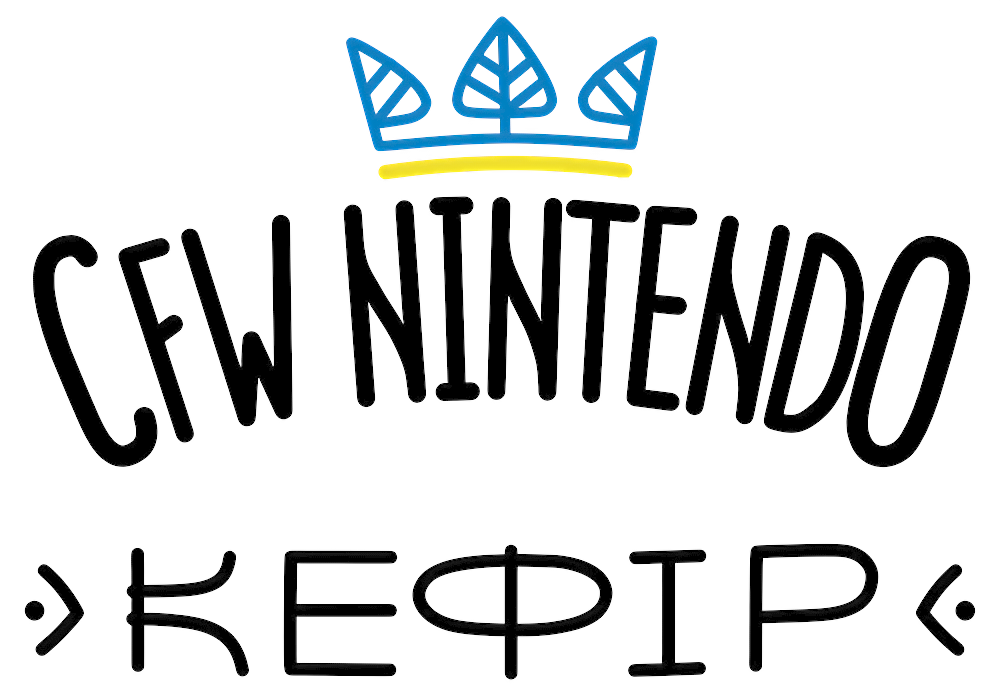

# 🥛 Kefir

<div align="center">
  
  <br><br>
  <a href="https://github.com/rashevskyv/kefir/releases"></a>
  <a href="https://github.com/rashevskyv/kefir/releases/latest"></a>
  <a href="https://github.com/rashevskyv/kefir/stargazers"></a>
  <br>
  <a href="README_ukr.md"></a>
</div>

## What is Kefir

Kefir is a ready-to-use package built around a modified Atmosphère, hekate, and a minimal recommended set of homebrew and modules, all pre-configured to work together. It exists to simplify installing and maintaining software on a hacked Nintendo Switch.

**Kefir is not a firmware!** It's a collection bundling Atmosphère with complementary tools.

Main differences from vanilla Atmosphère:

- Kefir versioning tracks system versioning, so you can tell what's installed just from the version numbers.
- exFAT memory card driver installed by default on system updates.
- Signature patches (via [sys-patch](https://github.com/borntohonk/sys-patch)) to run unsigned homebrew/games.
- Automatic key dump on boot: Kefir checks sysNAND/emuNAND versions and pulls keys from the newest one automatically and transparently.
- System logging disabled, avoiding memory card clutter and excess writes.
- Optional save redirection from internal storage to the memory card when using emuNAND, reducing the risk of save loss if emuNAND fails.

## Why do you need Kefir?

The goal is to simplify the user's life: with the recommended system version + the latest Kefir version, things should just work — a controlled, reproducible environment. Stating the system version and Kefir version is enough to know roughly what's installed.

## Compatibility

Full support up to firmware **22.1.0**.

> ⚠️ The old patch for legacy homebrew support no longer works. If an old homebrew stops working, repatch it via [hbpatcher.alula.me](https://hbpatcher.alula.me/).
>
> The old HBMenu forwarder will also launch with an error. Reinstall it via DBI as a "game" using `games/Homebrew menu [03DB12780BD84000][v0].nsp`. Forwarder-free alternative: launch the **Album** app while holding **R** until it boots into HBMenu. Details: [switch.customfw.xyz/hbl](https://switch.customfw.xyz/hbl).

## Kefir composition

1. **[Kefirosphere](https://github.com/rashevskyv/Kefirosphere)** — a fork of [Atmosphère](https://github.com/Atmosphere-NX/Atmosphere).
2. **[sys-patch](https://github.com/borntohonk/sys-patch)** — signature patches, lets you run unsigned (read: pirated) programs and games.
3. **Bootloader [hekate](https://github.com/CTCaer/hekate)** — boot menu, NAND backup/restore, EmuNAND creation, mounting the card to a PC without removing it from the console, repartitioning, and more.
4. **Installed payloads**:
   - [Lockpick_RCM](https://codeberg.org/rashevskyv/Locktrick/) — dumps console keys.
   - [TegraExplorer](https://github.com/rashevskyv/TegraExplorer/) — file manager as a payload (GodMode9-style, for Switch).
5. **Installed homebrew**:
   - [DBI](https://github.com/rashevskyv/dbi) — install games via USB or memory card.
   - [Tinfoil](http://tinfoil.io) — download games directly over the network.
   - [Kefir Updater](https://github.com/rashevskyv/kefir-updater) — update Kefir over the internet.
   - [Sphaira](https://github.com/ITotalJustice/sphaira/releases/) — environment for running homebrew, downloading themes/apps, file manager.
   - [Daybreak](https://github.com/Atmosphere-NX/Atmosphere/tree/0.14.1/troposphere/daybreak) — safe system firmware updates.
   - [NXThemes Installer](https://github.com/exelix11/SwitchThemeInjector) — custom theme manager.
   - [Linkalho](https://github.com/rdmrocha/linkalho) — account linking.
6. **Installed modules** (not supported on SX OS):
   - [sys-con](https://github.com/o0Zz/sys-con) — connect Xbox-compatible/generic controllers via USB.
   - [Mission Control](https://github.com/ndeadly/MissionControl) — connect controllers via Bluetooth.
   - **[Ultrahand-Overlay](https://github.com/ppkantorski/Ultrahand-Overlay)** — system overlay with custom script/module support (replaced the old Uberhand: faster and more flexible). Activation: **(L) + d-pad down + (R3)**.
     - Scripts: **DBI** language/update helper, **Translate Interface**, **Semi-stock**, **Reboot and Shutdown**.
     - Modules: [nx-ovlloader](https://github.com/ppkantorski/nx-ovlloader) (updated fork, runs `.ovl`/`.nro` via Tesla Menu), [ovlEdiZon](https://github.com/proferabg/EdiZon-Overlay/releases) (cheats), [ovlSysmodules](https://github.com/WerWolv/ovl-sysmodules/) (toggle installed sysmodules, e.g. overclock, emuiibo).

## Installing / Updating

### First installation or clean memory card

1. Copy the **contents** of `kefir.zip` (from the [releases](https://github.com/rashevskyv/kefir/releases) page) to the root of the memory card.
2. Insert the card into the Switch.
3. Inject `payload.bin` (included in the zip) using your hack method of choice (e.g. Fusée Gelée).

### Updating Kefir or migrating from another collection

#### Manual installation (any OS)

**Connecting the memory card to a PC:**

- macOS users: follow the recommended steps to avoid card issues.
- Console off: insert the card directly into the PC.
- Console on:
  1. Reboot via the menu triggered by holding **POWER**.
  2. On the Kefir splash screen, hold **volume down** to reach hekate.
  3. Remove the card from the console and insert it into the PC.

> Removing the card from hekate doesn't require re-injecting the payload — just reinsert the card and boot via **Launch**.

**Installing Kefir:**

1. Copy the **contents** of `kefir.zip` to the root of the card.
2. Reinsert the card into the Switch.
3. In **hekate**: **More configs → Update Kefir**.
4. Once done, the console boots straight into the firmware.

> Alternative: power off the console, swap files with the card removed, reinsert it, and power on — the update script runs automatically.

#### Updating directly on the console (Kefir 529+)

1. Launch HBL.
2. Select **Kefir Updater** (needs internet).
3. **Update Kefir → Kefir [version] → Download**.
4. Wait for download/unpacking, tap **Continue**. The console reboots into the payload and installs.
5. Once done, press any button to load the firmware.

#### Clean install (recommended if you hit errors)

1. Delete everything on the card except the `Nintendo` and `emummc` folders, if present.
2. Install using any method above.

#### Debug install (if a clean install didn't help)

1. Copy `Nintendo` and `emummc` to a PC.
2. Format the card as FAT32 and copy the folders back.
3. Install normally.

### Troubleshooting

`[NOFAT]` error or `kefir-updater` failing? Use `install.bat` instead:

1. Extract `kefir.zip` anywhere **on the PC** (never on the console's card).
2. Insert the card into the PC.
3. Run `install.bat` from the extracted folder and specify your card's drive letter.
4. Wait for the copy to finish.
5. Insert the card into the console and boot.

> "**Is BEK missing**" error? Power the console off and on again.

## Launching Atmosphère

Console doesn't see the card / asks for a firmware update / hangs on a black screen after the logo? exFAT drivers are missing — format the card as FAT32.

Autoboot is enabled by default in hekate, so the hekate menu won't show; firmware launches immediately. Hold **VOL-** during the splash screen to reach the hekate menu instead.

**Important:**

- Rebooting to hekate is done straight from the firmware's normal reboot menu — just hold **VOL-** during the Kefir splash.
- Access your card without removing it from the console via MTP (**DBI → Run MTP Responder**) or via hekate (doesn't work reliably for everyone; **you can't update Kefir over MTP**).
- Installing and updating Kefir use the same process.
- "**Is BEK missing**" error? Power off and on again.

## Additional information

- To configure modules ([sys-con](https://github.com/o0Zz/sys-con), [Mission Control](https://github.com/ndeadly/MissionControl), etc.), use **Ultrahand-Overlay**: **(L) + d-pad down + (R3)**.
- Save redirection (emuNAND → card): enable in **Ultrahand → Settings → Advanced**. Saves now live directly inside your emuNAND's own folder (no longer in `atmosphere/saves`). Experimental.
- Key dumping is now automatic on every boot — no manual step needed.
- Semi-stock:
  - From the firmware itself: Ultrahand → right → `Semi-stock`.
  - At boot: hekate → `More configs` → `Semi-stock (blackscreen fix)`.
  - Launching via firmware disables the installed theme (avoids errors across mismatched system/emuNAND versions).
- Updates are handled by the **Kefir Updater** utility.

### Overclocking

- **Enable**: Ultrahand → right → `Settings` → `Use overclock`.
- **Disable**: Ultrahand → right → `Settings` → `Disable overclock`.

### 8GB memory support mode

- **Enable**: Ultrahand → right → `Settings` → `Enable 8GB support`.
- **Disable**: reinstall Kefir.

---

## Donate to kefir's dev
### Paypal
[](https://www.paypal.com/donate/?hosted_button_id=S5BLF972J8G92)

### Банка monobank
[](https://send.monobank.ua/jar/9PwYEXHYbs)

## Donate for support Ukraine
### 🇺🇦 UKRAINE NEEDS YOUR HELP NOW!
>
> I'm the creator of this project and I'm Ukrainian.
>
> **My country, Ukraine, [is being invaded by the Russian Federation, right now](https://www.bbc.com/news/world-europe-60504334)**. I've fled Ivano-Frankivs'k and now I'm safe with my family in the western part of Ukraine. At least for now.
> Russia is hitting target all over my country by ballistic missiles.
>
> **Please, save me and help to save my country!**
>
> Ukrainian National Bank opened [an account to Raise Funds for Ukraine’s Armed Forces](https://bank.gov.ua/en/news/all/natsionalniy-bank-vidkriv-spetsrahunok-dlya-zboru-koshtiv-na-potrebi-armiyi):
>
> ```
> SWIFT Code NBU: NBUA UA UX
> JP MORGAN CHASE BANK, New York
> SWIFT Code: CHASUS33
> Account: 400807238
> 383 Madison Avenue, New York, NY 10179, USA
> IBAN: UA843000010000000047330992708
> ```
> 
> [Come Back and Alive found (savelife.in.ua)](https://savelife.in.ua/)
> 
> ```
> BITCOIN
> bc1qkd5az2ml7dk5j5h672yhxmhmxe9tuf97j39fm6
> 
> ETHEREUM (eth, usdt, usdc)
> 0xa1b1bbB8070Df2450810b8eB2425D543cfCeF79b
> 0x93Bda139023d582C19D70F55561f232D3CA6a54c
> 
> TRC20 (tether)
> TX9aNri16bSxVYi6oMnKDj5RMKAMBXWzon
> 
> Solana (sol)
> 8icxpGYCoR8SRKqLYsSarcAjBjBPuXAuHkeJjJx5ju7a
> ```
>
> You can also donate to [charity supporting Ukrainian army](https://savelife.in.ua/en/donate/).
>
> **THANK YOU!**